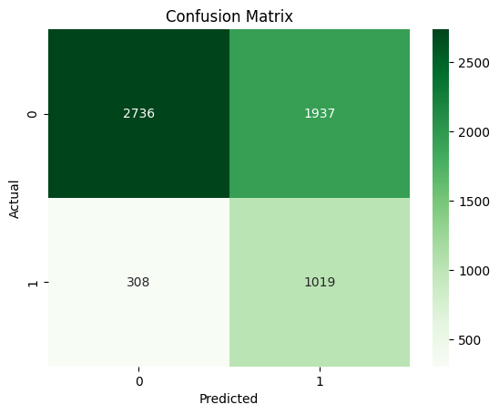
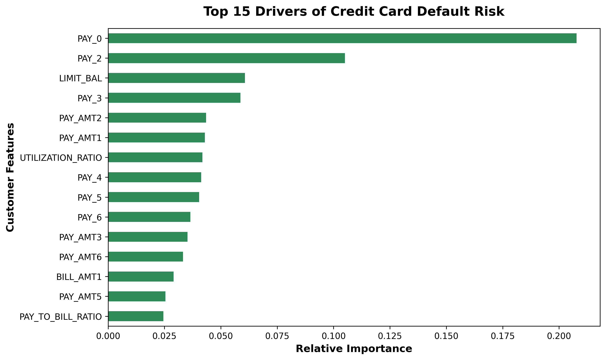

# Credit Card Default Predictor

Hi! Welcome to my machine learning project. a model I built to predict if a credit card customer is going to default on their payment next month. I used the UCI Credit Card dataset for this project.

I originally thought I just needed to get the highest accuracy possible but working on this project taught me a lot about how machine learning actually works in the real business world. 

# The Biggest Challenge Imbalanced Data
When I first ran my Random Forest model, it had a great accuracy score, but I realized it was completely missing the actual defaulters! Because 78% of the people in the dataset paid their bills on time, the model was basically guessing Safe for everyone. 

To fix this, I had to learn a few new techniques:

1. **Feature Engineering:** I created a few of my own columns before feeding the data to the model, like calculating the user's Credit Utilization Ratio.
2. **SMOTE:** I used the imbalanced-learn library to generate synthetic examples of defaulters so my training data was evenly balanced.
3. **Cost-Sensitive Learning:** This was the coolest part. I adjusted the class_weight parameter in my Random Forest model to {0: 1, 1: 2}. I mathematically forced the algorithm to realize that missing a defaulter is twice as worse as accidentally flagging a safe customer!

#  My Results
By telling the model to care more about the defaulters, the results completely flipped in a good way!

* My native recall jumped to **77%**.
* The final model successfully caught 1,019 out of 1,327 actual defaulters in my test data.
* My first baseline model missed over 700 defaults, but this optimized version only missed 308. 

It did create more "False Positives" (flagging safe people for review), but from a bank's perspective, it's much cheaper to send an automated check-in email to a safe customer than it is to lose thousands of dollars on a missed default.

### Visualizing the Change
*(Note: I've included screenshots of my charts below to show how the model improved!)*


> *My final confusion matrix. You can see it aggressively catches the True Positives (bottom right) and avoids the False Negatives (bottom left).*


> *This chart shows which features the Random Forest thought were most important. My custom Utilization ratio ended up being a huge help!*

# Tools Used
* **Python** * **Pandas & NumPy** (for cleaning and exploring the data)
* **Scikit-Learn** (for the Random Forest model and evaluation metrics)
* **Imbalanced-Learn** (for SMOTE)
* **Matplotlib & Seaborn** (for the graphs)

# How to check it out yourself
If you want to run my code on your own machine, follow these steps:

1. Clone this repository to your computer.
2. Download the UCI Credit Card dataset and save it in the same folder as `UCI_Credit_Card.csv`.
3. Install the libraries I used by running:
   ```bash
   pip install -r requirements.txt